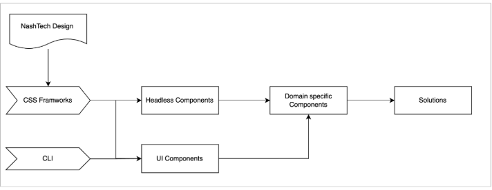

# NashTech Design System

## Overview

NashTech Design System provides a scalable, efficient, and customizable UI framework built with **Figma**, **Tailwind CSS**, and **shadcn/ui**. It includes a comprehensive set of **components, themes, layouts, and CLI tools** to streamline development.


## Prerequisites

Before running the project, ensure the following tools are installed:

-   [Node.js](https://nodejs.org/) (v20)
-   [Pnpm](https://pnpm.io/)
-   [Nx CLI](https://nx.dev/getting-started/intro)

### Install dependencies

```bash
pnpm install
```

### Deploy Status

[](https://app.netlify.com/sites/nashtech-storybook/deploys)
