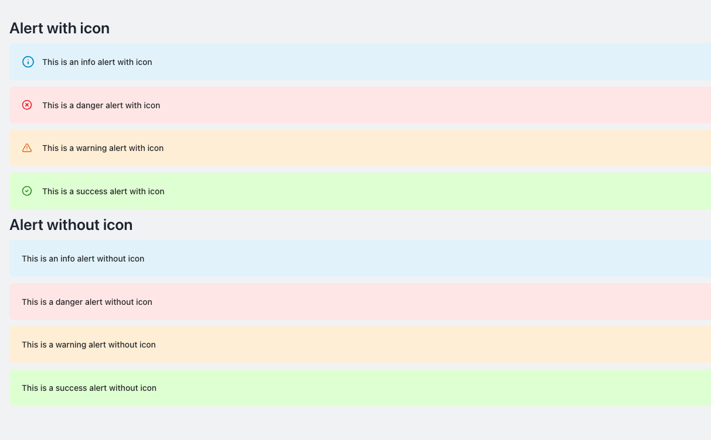

# Alert Component

<<<<<<< HEAD

=======

>>>>>>> bf11bea (- feat: add alert style sheet)

The Alert component in NT Stylesheet is used to display contextual feedback messages for user actions, with optional icons and dismiss buttons.

## Features

<<<<<<< HEAD
- Four alert types: info, danger, warning, success
- Optional icons with the nt-alert-has-icon modifier
- Dismiss button with accessible aria-label
- Fully responsive and styled using Tailwind utility classes

## Installation

- Import the stylesheet in your project:
=======
-   Four alert types: info, danger, warning, success
-   Optional icons with the nt-alert-has-icon modifier
-   Dismiss button with accessible aria-label
-   Fully responsive and styled using Tailwind utility classes

## Installation

-   Import the stylesheet in your project:
>>>>>>> bf11bea (- feat: add alert style sheet)

```javascript
import '@nashtech/nt-stylesheet/dist/nt-stylesheet.css'
```

## Usage

### Alert Types

Use the following modifier classes for different alert contexts:

<<<<<<< HEAD
- `nt-alert-info`
- `nt-alert-danger`
- `nt-alert-warning`
- `nt-alert-success`
=======
-   `nt-alert-info`
-   `nt-alert-danger`
-   `nt-alert-warning`
-   `nt-alert-success`
>>>>>>> bf11bea (- feat: add alert style sheet)

### Example

```html
<div class="nt-alert nt-alert-success" role="alert">
    <span class="nt-alert-message"
        >Action completed successfully</span
    >
    <button class="nt-alert-close" aria-label="Close">✕</button>
</div>
```

### Alerts with Icons

To include an icon, add the `nt-alert-has-icon` class:

```html
<div class="nt-alert nt-alert-info nt-alert-has-icon" role="alert">
    <span class="nt-alert-message"
        >This is an info alert with icon</span
    >
    <button class="nt-alert-close" aria-label="Close">✕</button>
</div>
```

### Dismiss Button

All alerts include a close button:

<<<<<<< HEAD
- Use `nt-alert-close` for styling.
- Add aria-label="Close" for accessibility.
=======
-   Use `nt-alert-close` for styling.
-   Add aria-label="Close" for accessibility.
>>>>>>> bf11bea (- feat: add alert style sheet)

Note: Dismissing functionality should be implemented with JavaScript if needed.
