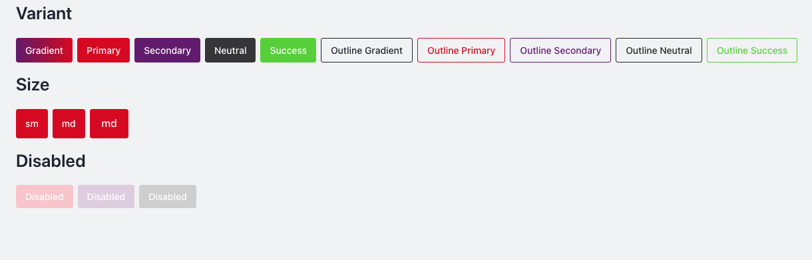

# Button Component Documentation



The `nt-button` component follows NT Stylesheet guidelines and supports a wide range of variants, sizes, and states.

## Usage

```html
<button class="nt-button nt-button-primary">Primary</button>
```

Ensure you’ve imported the NT Stylesheet in your project:

```html
import '@nashtech/nt-stylesheet/dist/nt-stylesheet.css';
```

## Variants

| Class Name                              | Description       |
| --------------------------------------- | ----------------- |
| `nt-button-gradient`                    | Gradient button   |
| `nt-button-primary`                     | Primary style     |
| `nt-button-secondary`                   | Secondary style   |
| `nt-button-neutral`                     | Neutral style     |
| `nt-button-success`                     | Success style     |
| `nt-button-outline nt-button-primary`   | Primary outline   |
| `nt-button-outline nt-button-secondary` | Secondary outline |
| `nt-button-outline nt-button-neutral`   | Neutral outline   |
| `nt-button-outline nt-button-success`   | Success outline   |

```html
<button class="nt-button nt-button-primary">Primary</button>
<button class="nt-button nt-button-outline nt-button-primary">
    Outline Primary
</button>
```

## Sizes

| Class Name            | Size   |
| --------------------- | ------ |
| `nt-button-sm`        | Small  |
| `nt-button` (default) | Medium |
| `nt-button-lg`        | Large  |

```html
<button class="nt-button nt-button-primary nt-button-sm">
    Small
</button>
<button class="nt-button nt-button-primary">Medium</button>
<button class="nt-button nt-button-primary nt-button-lg">
    Large
</button>
```

## Disabled State

-   Override styles using custom classes or utility classes as needed.
-   Example
Use the disabled attribute to visually and functionally disable a button.

```html
<button class="nt-btn nt-btn-primary nt-btn-lg">
    Large Primary Button
</button>
<button class="nt-button nt-button-primary" disabled>Disabled</button>
```

