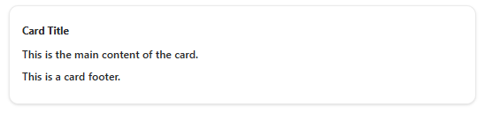
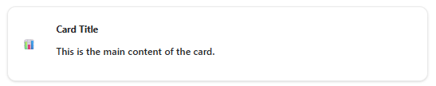
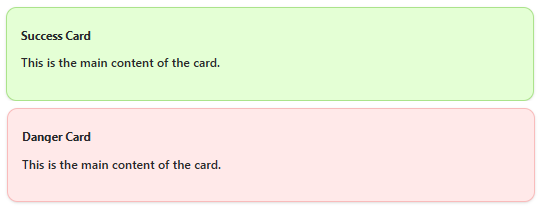

# Card Component

The **Card** component is a versatile and customizable UI element that can be used to display a variety of content, such as text, images, and actions. It is designed to be flexible and adaptable to different use cases.

## Features

-   Header: The Card component has a header section that can display a title, description, and actions.
-   Content: The Card component has a content section that can display arbitrary content, such as text, images, and other UI elements.
-   Footer: The Card component has a footer section that can display additional content or actions.
-   Variant: The Card component has several variants, including default, success, primary, and danger, which can be used to change the appearance of the card.
-   Icon: The Card component can display an icon in the header section.

## Installation

Import the stylesheet in your project:

```javascript
import '@nashtech-garage/nt-stylesheet/dist/nt-stylesheet.css'
```

## Usage

### Card Variants

Use the following variant classes for cards:

-   `nt-card-success`
-   `nt-card-primary`
-   `nt-card-danger`
-   `nt-card-default`
-   `nt-card-small`

### Example

#### Basic Example



```html
<div class="nt-card-default">
    <div class="nt-card-header">
        <span class="nt-card-title">Card Title</span>
    </div>
    <div class="nt-card-content">
        <p>This is the main content of the card.</p>
    </div>
    <div class="nt-card-footer">
        <button class="nt-btn-primary">OK</button>
    </div>
</div>
```

#### Example with Icon



```html
<div class="nt-card-default">
    <div class="nt-card-header">
        
        <span class="nt-card-title">Card Title</span>
    </div>
    <div class="nt-card-content">
        <p>This is the main content of the card.</p>
    </div>
</div>
```

#### Example with Variant



```html
<div class="nt-card-success">
    <div class="nt-card-header">
        <span class="nt-card-title">Success Card</span>
    </div>
    <div class="nt-card-content">
        <p>This is the main content of the card.</p>
    </div>
</div>

<div class="nt-card-danger">
    <div class="nt-card-header">
        <span class="nt-card-title">Danger Card</span>
    </div>
    <div class="nt-card-content">
        <p>This is the main content of the card.</p>
    </div>
</div>
```
