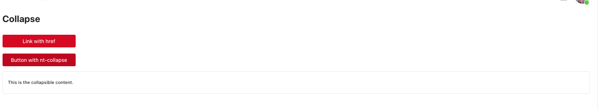

# Collapse Component



The Collapse component in NT Stylesheet enables you to toggle the visibility of content sections with smooth height transitions, using data attributes alone — no custom JavaScript needed. It's useful for FAQs, menus, or expandable content blocks.

## Features

-   Toggle collapsible content using data-nt-collapse
-   Smooth height animation using scrollHeight and transition
-   Auto-updates aria-expanded for accessibility
-   Fully customizable with Tailwind utility classes
-   Zero-JS integration: works with declarative data attributes

## Installation

Import the stylesheet and script in your project:

```js
import '@nashtech-garage/nt-stylesheet/dist/nt-stylesheet.css'
import '@nashtech-garage/nt-stylesheet/dist/scripts/nt.js'
```

## Usage

Use the data-nt-collapse attribute on a trigger element and point it to the ID of the collapsible target.

```html
<button data-nt-collapse="#collapseTarget" aria-expanded="false">
    Toggle Collapse
</button>

<div id="collapseTarget" class="nt-collapse">
    <p>
        This is the content that will expand or collapse when the
        button is clicked.
    </p>
</div>
```

## Collapse Markup

Trigger element requires data-nt-collapse and should point to the target’s ID.

The collapsible target should have the .nt-collapse class.

The JavaScript handles the height transition and toggling of the show class.

```html
<button data-nt-collapse="#faq1" class="text-blue-600 underline">
    What is your return policy?
</button>

<div id="faq1" class="nt-collapse mt-2">
    <p>
        You can return any item within 30 days of purchase for a full
        refund.
    </p>
</div>
```

## Behavior

-   Adds `.show` class and sets height to scrollHeight when expanded.
-   Removes `.show` and animates height to 0 when collapsed.
-   Automatically updates aria-expanded on the trigger button.
-   After transition ends, height is reset to allow dynamic resizing.

## Accessibility

-   Toggle button includes aria-expanded which reflects the collapse state.
-   Use semantic HTML inside the collapsed content for screen reader support.
-   The collapsible content area can be given role="region" and aria-labelledby for further a11y enhancement.

```html
<div
    id="collapseTarget"
    class="nt-collapse"
    role="region"
    aria-labelledby="collapseButton"
>
    ...
</div>
```

[Back to docs index](README.md)
