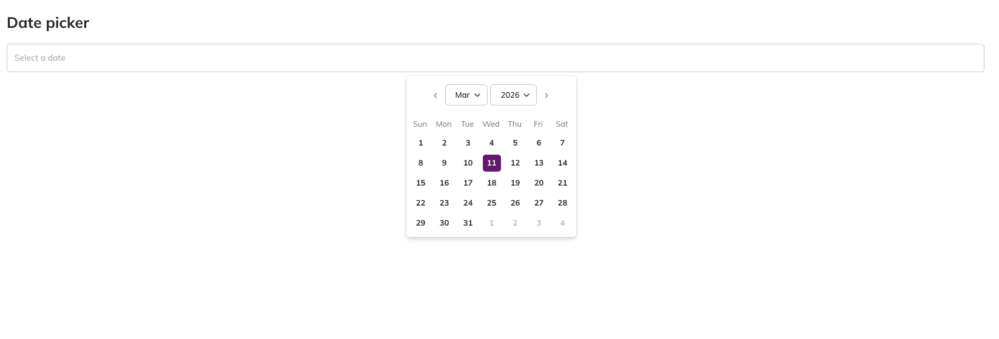

# Date Picker Component

The **Date Picker** component in NT Stylesheet provides a customizable calendar UI for selecting dates from an input field.



## Features

* Interactive calendar panel for selecting dates
* Automatically formats the selected date in the input
* Supports custom date formats via `data-format`
* Automatically positions the calendar panel relative to the input
* Click outside to close the panel
* Lightweight implementation with **date-fns**
* Accessible and easy to integrate

## Installation

Import the stylesheet in your project:

```javascript
import '@nashtech-garage/nt-stylesheet/dist/nt-stylesheet.css'
```

Then initialize the date picker in your JavaScript:

```javascript
import { NtDatePicker } from '@nashtech-garage/nt-stylesheet'

new NtDatePicker()
```

## Usage

Add the `data-nt-datepicker` attribute to any input field where you want the date picker enabled.

```html
<input data-nt-datepicker />
```

When the input receives focus, the calendar panel will automatically appear.

## Custom Date Format

You can specify the display format using the `data-format` attribute.

```html
<input data-nt-datepicker data-format="dd/MM/yyyy" />
```

Example formats:

| Format       | Example    |
| ------------ | ---------- |
| `dd/MM/yyyy` | 11/03/2026 |
| `MM/dd/yyyy` | 03/11/2026 |
| `yyyy-MM-dd` | 2026-03-11 |

Date formatting uses **date-fns** format tokens.

## Layouts

The date picker panel automatically renders a calendar interface including:

* Month selector
* Year selector
* Navigation buttons
* Day grid

The panel uses the following class for styling
[react-datepicker](https://github.com/Hacker0x01/react-datepicker)

## Example Markup

```html
<main>
    <input
        data-nt-datepicker
        data-format="dd/MM/yyyy"
        placeholder="Select a date"
    />
</main>
```

When the input is focused, a calendar panel will appear allowing the user to pick a date.

## Accessibility

The date picker panel uses semantic roles to improve accessibility:

* `role="group"` for the calendar container
* Keyboard navigation supported through native input focus

## Behavior

| Interaction       | Result               |
| ----------------- | -------------------- |
| Click input       | Opens calendar panel |
| Select day        | Updates input value  |
| Change month/year | Calendar updates     |
| Click outside     | Panel closes         |

[Back to docs index](README.md)
