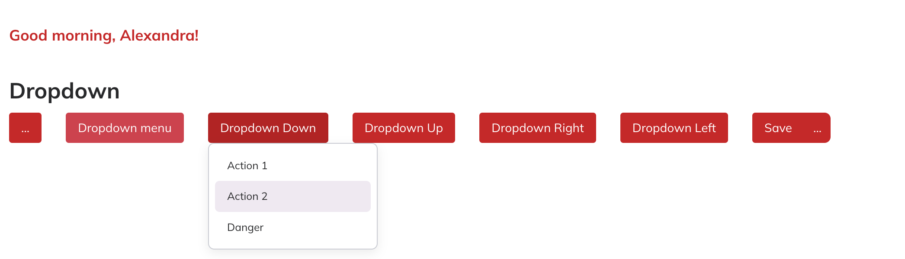

# Dropdown Component



The Dropdown component in NT Stylesheet provides a flexible menu system for actions, links, and options. It supports multiple placements, split buttons, and integrates seamlessly with NT’s button utilities.

## Features

-   Toggle dropdown menus using data-nt-toggle="dropdown".
-   Supports four placements: down, up, left, right.
-   Auto-updates aria-expanded for accessibility.
-   Supports dividers, active states, and danger actions.
-   Works with split button groups.
-   Fully customizable with Tailwind utility classes.

## Installation

Import the stylesheet and script in your project:

```js
import '@nashtech-garage/nt-stylesheet/dist/nt-stylesheet.css'
import '@nashtech-garage/nt-stylesheet/dist/scripts/nt.js'
```

## Usage

Use the `data-nt-toggle="dropdown"` attribute on a trigger button and wrap the dropdown content inside`.nt-dropdown-menu.`

```html
<div class="nt-dropdown">
    <button
        class="nt-button nt-button-primary"
        data-nt-toggle="dropdown"
        aria-expanded="false"
    >
        Dropdown
    </button>
    <ul class="nt-dropdown-menu">
        <li><a class="nt-dropdown-menu-item" href="#">Action</a></li>
        <li>
            <a class="nt-dropdown-menu-item active" href="#"
                >Active</a
            >
        </li>
        <li><hr class="nt-dropdown-menu-divider" /></li>
        <li>
            <a class="nt-dropdown-menu-item danger" href="#"
                >Delete</a
            >
        </li>
    </ul>
</div>
```

## Dropdown Markup

-   The trigger requires `data-nt-toggle="dropdown"`.
-   The menu uses `.nt-dropdown-menu.`
-   Items use `.nt-dropdown-menu-item.`
-   Use `.nt-dropdown-menu-divider` to insert dividers.

```html
<div class="nt-dropdown">
    <button
        class="nt-button nt-button-primary"
        data-nt-toggle="dropdown"
        aria-expanded="false"
    >
        Actions
    </button>
    <div class="nt-dropdown-menu">
        <div class="nt-dropdown-menu-item">Profile</div>
        <div class="nt-dropdown-menu-item">Settings</div>
        <div class="nt-dropdown-menu-divider"></div>
        <div class="nt-dropdown-menu-item danger">Logout</div>
    </div>
</div>
```

## Placement

Control the dropdown’s direction with data-nt-placement:

```html
<button data-nt-toggle="dropdown" data-nt-placement="down">
    Down
</button>
<button data-nt-toggle="dropdown" data-nt-placement="up">Up</button>
<button data-nt-toggle="dropdown" data-nt-placement="right">
    Right
</button>
<button data-nt-toggle="dropdown" data-nt-placement="left">
    Left
</button>
```

The script automatically applies .is-down, .is-up, .is-right, or .is-left to the .nt-dropdown.

## Split Button

Dropdowns can also be used in a split button group:

```html
<div class="nt-split-button nt-dropdown">
    <button class="nt-button nt-button-primary nt-rounded-end-0">
        Save
    </button>
    <button
        class="nt-dropdown-toggle nt-button nt-rounded-top-0 nt-button-primary"
        data-nt-toggle="dropdown"
        aria-expanded="false"
        data-nt-placement="down"
    >
        ...
    </button>

    <div class="nt-dropdown-menu">
        <div class="nt-dropdown-menu-item">Save as Draft</div>
        <div class="nt-dropdown-menu-item">Save & Publish</div>
        <div class="nt-dropdown-menu-divider"></div>
        <div class="nt-dropdown-menu-item">Cancel</div>
    </div>
</div>
```

## Behavior

-   Adds is-open and placement classes when expanded.
-   Closes other dropdowns automatically when one is opened.
-   Removes classes and resets aria-expanded when closed.
-   Clicking outside closes all dropdowns.

[Back to docs index](README.md)
