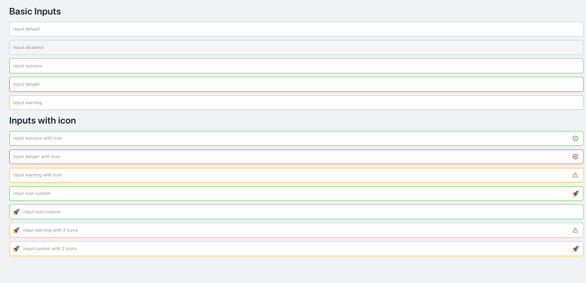

# Input Component

The Input component in NT Stylesheet is a customizable form element that supports validation states, icon placement, and visual variants.



## Features

-   Base input styles with consistent spacing and radius
-   Visual variants: default, success, danger, warning
-   Disabled state styling
-   Optional left and/or right icons
-   Utility classes for layout (container helpers)

## Installation

Import the stylesheet in your project:

```js
import '@nashtech/nt-stylesheet/dist/nt-stylesheet.css'
```

## Usage

### Basic Inputs

Use nt-input along with a variant modifier class:

-   `nt-input-default`
-   `nt-input-success`
-   `nt-input-danger`
-   `nt-input-warning`

```html
<input
    type="text"
    class="nt-input nt-input-default"
    placeholder="Input default"
/>
<input
    type="text"
    class="nt-input nt-input-success"
    placeholder="Input success"
/>
<input
    type="text"
    class="nt-input nt-input-danger"
    placeholder="Input danger"
/>
<input
    type="text"
    class="nt-input nt-input-warning"
    placeholder="Input warning"
/>
<input
    type="text"
    class="nt-input nt-input-danger"
    disabled
    placeholder="Input disabled"
/>
```

### Inputs with Status Icons

Wrap inputs with nt-input-container-[variant] to display right-side icons automatically:

```html
<div class="nt-input-container nt-input-container-success">
    <input
        type="text"
        class="nt-input nt-input-success"
        placeholder="Success with icon"
    />
</div>
<div class="nt-input-container nt-input-container-danger">
    <input
        type="text"
        class="nt-input nt-input-danger"
        placeholder="Danger with icon"
    />
</div>
<div class="nt-input-container nt-input-container-warning">
    <input
        type="text"
        class="nt-input nt-input-warning"
        placeholder="Warning with icon"
    />
</div>
```

### Inputs with Custom Icons

Use `<span class="nt-input-icon">` for custom emojis or icon fonts.

#### Icon Right

```html
<div class="nt-input-container">
    <input
        type="text"
        class="nt-input nt-input-success"
        placeholder="Custom icon right"
    />
    <span class="nt-input-icon">🚀</span>
</div>
```

#### Icon Left

```html
<div class="nt-input-container">
    <span class="nt-input-icon">🚀</span>
    <input
        type="text"
        placeholder="input icon custom"
        class="nt-input nt-input-success"
    />
</div>
```

#### Both Sides

```html
<div class="nt-input-container mb-3">
    <span class="nt-input-icon">🚀</span>
    <input
        type="text"
        placeholder="input custom with 2 icons"
        class="nt-input nt-input-warning"
    />
    <span class="nt-input-icon">🚀</span>
</div>
```

### Utilities

-   `.nt-input`: Base input style
-   `.nt-input-[variant]`: Visual styling (e.g., success, danger, etc.)
-   `.nt-input-container`: Enables icon positioning
-   `.nt-input-container-[variant]` – Enables status icon per variant
-   `.nt-input-icon`: Icon custom

---

[Back to docs index](README.md)
