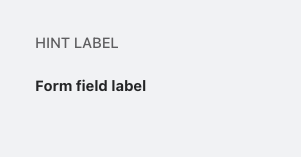

# Label Component


The Label component in NT Stylesheet provides consistent styling for form labels and contextual hints. It ensures clarity, accessibility, and spacing alignment across form elements.

## Features

-   Supports contextual hint labels and form field labels
-   Aligns with spacing and typography system
-   Easily customizable with utility classes

## Installation

-   Import the stylesheet in your project:

```javascript
import '@nashtech/nt-stylesheet/dist/nt-stylesheet.css'
```

## Usage

Use semantic `<label>` elements with the appropriate NT classes:

```html
<label class="nt-label nt-label-hint">This is a hint label</label>
<label class="nt-label nt-label-form-field" for="email"
    >Email Address</label
>
```

## Label Variants

-   `nt-label-hint` – For auxiliary or instructional text
-   `nt-label-form-field`– For standard form field labels

---

[Back to docs index](README.md)
