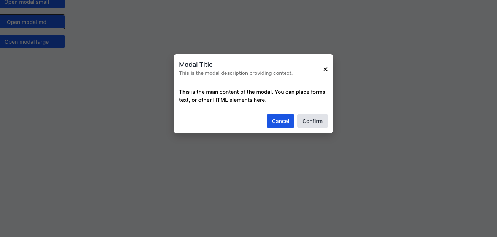

# Modal Component



The Modal component in NT Stylesheet provides a flexible, customizable overlay dialog that supports different sizes, animations, and accessibility features. It can be triggered declaratively using data-nt-toggle="modal" and dismissed with data-nt-dismiss="modal".

## Features

-   Trigger modal via data attributes without custom JavaScript
-   Auto-centers with darkened background overlay
-   Supports multiple sizes: small (nt-modal-box-sm), default, large (nt-modal-box-lg)
-   Keyboard ESC to close and backdrop click support
-   Fully customizable with Tailwind utility classes

## Installation

Import the stylesheet in your project:

```javascript
import '@nashtech/nt-stylesheet/dist/nt-stylesheet.css'
import '@nashtech/nt-stylesheet/dist/scripts/nt.js'
```

## Usage

-   Trigger Button: Use`data-nt-toggle="modal"` and `data-nt-target="#modalId"` to open a modal.

```html
<button data-nt-toggle="modal" data-nt-target="#modal">
    Open modal small
</button>
```

## Modal Markup

Wrap your modal content in a container with class `.nt-modal` and a unique `id`. Use `.nt-modal-box-sm` for a small modal, or omit for default size.

```html
<div id="modal" class="nt-modal hidden" tabindex="-1">
    <div class="nt-modal-box nt-modal-box-sm">
        <div class="nt-modal-header">
            <div>
                <h2 class="nt-modal-title">Modal Title</h2>
                <p class="nt-modal-description">
                    This is the modal description providing context.
                </p>
            </div>
            <span class="nt-modal-close" data-nt-dismiss="modal"
                >&times;</span
            >
        </div>
        <div class="nt-modal-content">
            <p>
                This is the main content of the modal. You can place
                forms, text, or other HTML elements here.
            </p>
        </div>
        <div class="nt-modal-footer">
            <a
                href="#"
                class="px-4 py-2 bg-blue-600 text-white rounded hover:bg-blue-700"
            >
                Cancel
            </a>
            <a
                href="#"
                class="px-4 py-2 bg-gray-200 text-gray-800 rounded hover:bg-gray-300"
            >
                Confirm
            </a>
        </div>
    </div>
</div>
```

### Sizes

Use one of the following classes inside .nt-modal-box:

-   `.nt-modal-box-sm` – Small
-   `.nt-modal-box`– Default
-   `.nt-modal-box-lg` – Large

### Accessibility

-   The modal uses `tabindex="-1"` and can be focused.
-   Pressing ESC or clicking on the backdrop will close the modal.
-   Use semantic HTML (e.g. <h2> for title) for better screen reader support.

---

[Back to docs index](README.md)
