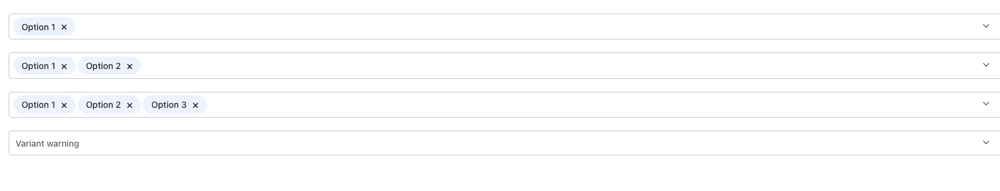

# MultiSelect Component



The MultiSelect component in NT Stylesheet transforms a native `<select multiple>` element into a customizable, tag-based multi-selection UI with keyboard and mouse support. It enhances accessibility and UX while maintaining native form compatibility.

## Features

-   Automatically enhances any `<select multiple>` with data-nt-multi-select
-   Supports variant styling via data-variant
-   Dynamic tag display for selected options
-   Searchable dropdown that filters options
-   Click to add/remove items and keyboard-friendly

## Installation

Import the stylesheet and script in your project:

```javascript
import '@nashtech-garage/nt-stylesheet/dist/nt-stylesheet.css'
import '@nashtech-garage/nt-stylesheet/dist/scripts/nt.js'
```

## Usage

Simply add data-nt-multi-select to a native `<select multiple>` element:

```html
<select
    data-nt-multi-select
    multiple
    data-placeholder="Choose fruits"
>
    <option value="1">Apple</option>
    <option value="2">Banana</option>
    <option value="3">Cherry</option>
</select>
```

## Variant Styling

Customize appearance using data-variant:

```html
<select data-nt-multi-select multiple data-variant="danger">
    <option value="1">Apple</option>
    <option value="2">Banana</option>
</select>
```

## Supported variants

-   primary → .nt-multi-select-primary
-   danger → .nt-multi-select-danger
-   success → .nt-multi-select-success

## Placeholder

Set a placeholder using data-placeholder:

```html
<select
    data-nt-multi-select
    multiple
    data-placeholder="Select options"
>
    <option>Item 1</option>
</select>
```

## Interactions

-   Clicking an option adds it as a tag and marks it selected
-   Clicking a tag's “×” removes it from selection
-   Click outside or press ESC to close the dropdown

## Accessibility

-   Fully keyboard-navigable
-   Uses native `<select>` element for compatibility with forms
-   Tags are screen-reader friendly
-   Works with browser validation

[Back to docs index](README.md)
