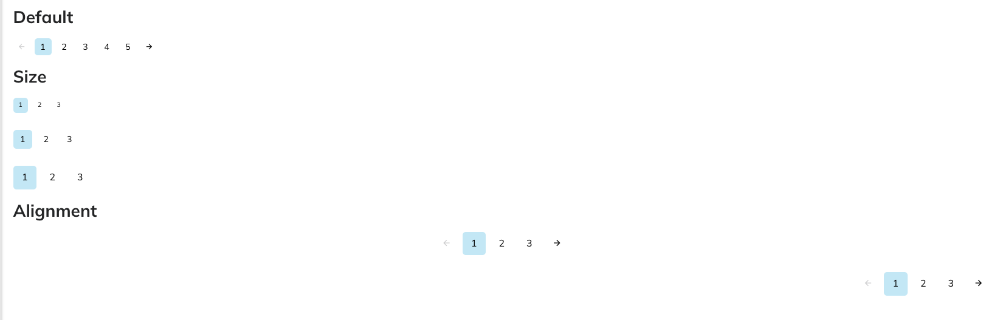

# Pagination Component



The Pagination component in NT Stylesheet provides a simple way to navigate through multi-page content. It supports active/disabled states, size variations, and previous/next controls. Pagination is styled with NT’s design tokens and built with vanilla HTML and CSS, with no JavaScript dependencies.

## Features

-   Navigate between multiple pages
-   Supports active and disabled states
-   Previous/next controls
-   Size variants: small, medium, large
-   Consistent hover and focus styles
-   Accessible markup with `<button>` or `<a>` elements

## Installation

Import the stylesheet into your project:
`import '@nashtech-garage/nt-stylesheet/dist/nt-stylesheet.css'`

## Usage

Basic Pagination

```html
<ul class="nt-pagination nt-pagination-md">
    <li class="nt-pagination-item nt-pagination-prev">
        <button>&laquo;</button>
    </li>
    <li class="nt-pagination-item active">
        <button>1</button>
    </li>
    <li class="nt-pagination-item">
        <button>2</button>
    </li>
    <li class="nt-pagination-item">
        <button>3</button>
    </li>
    <li class="nt-pagination-item nt-pagination-next">
        <button>&raquo;</button>
    </li>
</ul>
```

## States

-   Active Page
-   Highlights the current page:

```html
<li class="nt-pagination-item active"><button>2</button></li>
```

## Disabled

-   Grays out the item and prevents interaction:

```html
<li class="nt-pagination-item disabled"><button>&laquo;</button></li>
```

## Sizes

-   Pagination provides three sizes via modifier classes:

```html
<ul class="nt-pagination nt-pagination-sm">
    …
</ul>
<ul class="nt-pagination nt-pagination-md">
    …
</ul>
<ul class="nt-pagination nt-pagination-lg">
    …
</ul>
```

`nt-pagination-sm`: compact buttons (1.75rem, 0.75rem font)
`nt-pagination-md`: default buttons (2.25rem, 1rem font)
`nt-pagination-lg`: larger buttons (2.75rem, 1.125rem font)

## Advanced Options (via Classes)

| Class                | Description                              |
| -------------------- | ---------------------------------------- |
| `nt-pagination`      | Root container                           |
| `nt-pagination-item` | Single page item wrapper                 |
| `active`             | Highlights current page                  |
| `disabled`           | Styles item as disabled, removes pointer |
| `nt-pagination-prev` | Styles previous button wrapper           |
| `nt-pagination-next` | Styles next button wrapper               |
| `nt-pagination-sm`   | Small size variation                     |
| `nt-pagination-md`   | Medium (default) size variation          |
| `nt-pagination-lg`   | Large size variation                     |
