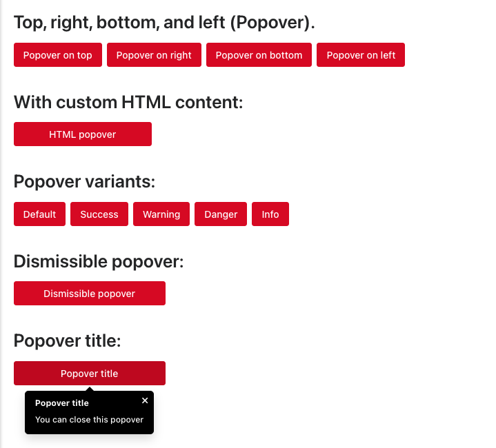

# Popover Component



The Popover component in NT Stylesheet provides richer, interactive content overlays than tooltips. Popovers are triggered by click and can include text, HTML, titles, and dismiss buttons. They're fully configurable via data-\* attributes and styled with visual variants.

## Features

-   Show popovers on click using data-nt-toggle="popover"
-   Supports plain text or HTML content
-   Optional title/header via data-nt-title
-   Optional dismiss (close × button)
-   Auto-closes on outside click
-   Visual variants like success, warning, danger, info
-   Positions: top, right, bottom, left
-   Built with vanilla JS, zero dependencies

## Installation

Import the stylesheet and script into your project:

```js
import '@nashtech-garage/nt-stylesheet/dist/nt-stylesheet.css'
import '@nashtech-garage/nt-stylesheet/dist/scripts/nt.js'
```

## Usage

### Basic Popover

Use `data-nt-toggle="popover"` and `data-nt-content="..."` on a button or element:

```js
<button
    class="nt-button nt-button-primary"
    data-nt-toggle="popover"
    data-nt-content="This is a popover."
>
    Click for popover
</button>
```

The popover will appear on click and disappear when clicking outside.

## Placements

Control popover position with data-nt-placement:

```html
<div class="flex gap-2">
    <button
        data-nt-toggle="popover"
        data-nt-placement="top"
        data-nt-content="Top"
    >
        Top
    </button>
    <button
        data-nt-toggle="popover"
        data-nt-placement="right"
        data-nt-content="Right"
    >
        Right
    </button>
    <button
        data-nt-toggle="popover"
        data-nt-placement="bottom"
        data-nt-content="Bottom"
    >
        Bottom
    </button>
    <button
        data-nt-toggle="popover"
        data-nt-placement="left"
        data-nt-content="Left"
    >
        Left
    </button>
</div>
```

## Popover with HTML

Enable data-nt-html="true" to safely render HTML using DOMPurify:

```html
<button
    data-nt-toggle="popover"
    data-nt-html="true"
    data-nt-content="<b>Bold</b> and <i>italic</i> content"
>
    HTML Popover
</button>
```

## Popover Title

Add a popover header using `data-nt-title`:

```html
<button
    data-nt-toggle="popover"
    data-nt-title="Popover Title"
    data-nt-content="This is the body"
>
    Titled Popover
</button>
```

### Dismissible Popover

Add a close × button inside the popover using data-nt-dismissible="true":

```html
<button
    data-nt-toggle="popover"
    data-nt-content="You can dismiss this"
    data-nt-dismissible="true"
>
    Dismissible
</button>
```

### Popover Variants

Apply visual styling using `data-nt-variant`:

```html
<button
    data-nt-toggle="popover"
    data-nt-content="Danger popover"
    data-nt-variant="danger"
>
    Danger
</button>
```

Available variants:

-   default (no variant)
-   success
-   warning
-   danger
-   info

### Advanced Options (via Attributes)

| Attribute             | Type                                                        | Default     | Description                                        |
| --------------------- | ----------------------------------------------------------- | ----------- | -------------------------------------------------- |
| `data-nt-toggle`      | `"popover"`                                                 | –           | Enables popover behavior on the element            |
| `data-nt-content`     | `string` or HTML                                            | –           | The popover body content                           |
| `data-nt-html`        | `true` \| `false`                                           | `false`     | Renders content as HTML (sanitized with DOMPurify) |
| `data-nt-title`       | `string`                                                    | –           | Optional header shown at the top of the popover    |
| `data-nt-placement`   | `'top'`, `'right'`, `'bottom'`, `'left'`                    | `'top'`     | Position of the popover relative to the element    |
| `data-nt-variant`     | `'default'`, `'success'`, `'warning'`, `'danger'`, `'info'` | `'default'` | Controls popover background and text color         |
| `data-nt-dismissible` | `true` \| `false`                                           | `false`     | Adds a dismiss (×) button in the popover           |
