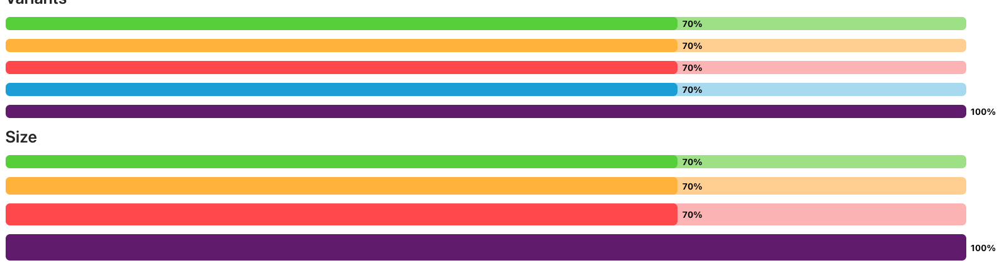

# Component


The Progress component in NT Stylesheet provides a customizable progress bar with support for multiple color variants, sizes, and optional labels. It's built entirely with CSS and follows a utility-first approach.

## Features

-   Customizable progress bar built with pure CSS
-   Supports variants like success, warning, and danger
-   Size options for small, medium, and large
-   Optional label inside or outside the bar
-   Easy to style using utility classes

## Installation

Import the stylesheet in your project:

```js
import '@nashtech-garage/nt-stylesheet/dist/nt-stylesheet.css'
```

## Usage

Use the `.nt-progress` class to apply base styles. Apply modifiers such as `-success`, `-danger`, or `-warning` for variants, and `-sm`, `-md`, or `-lg` for sizes. Add a `-label` class to display a percentage or custom label.

## Variants

`.nt-progress-success` – Green background
`.nt-progress-warning` – Orange background
`.nt-progress-danger` – Red background
`.nt-progress-info` – Blue background
`.nt-progress` – Default purple background

## Sizes

`.nt-progress`– (default / small)
`.nt-progress-md` - medium height
`.nt-progress-lg` – Taller bar
`.nt-progress-xl` – Tallest bar

## Example Markup

```html
<main>
    <h2 class=" nt-mb-4">Progress Bar</h2>
    <div class="nt-progress nt-mb-4">
        <div class="nt-progress-bar" style="width: 70%;">70%</div>
    </div>
    <div class="nt-progress nt-progress-success nt-mb-4">
        <div class="nt-progress-bar" style="width: 70%;">70%</div>
    </div>
    <div class="nt-progress nt-progress-warning nt-mb-4">
        <div class="nt-progress-bar" style="width: 50%;">50%</div>
    </div>
    <div class="nt-progress nt-progress-danger nt-mb-4">
        <div class="nt-progress-bar" style="width: 30%;">30%</div>
    </div>
    <div class="nt-progress nt-progress-info nt-mb-4">
        <div class="nt-progress-bar" style="width: 90%;">90%</div>
    </div>
</main>
```

---

[Back to docs index](README.md)
