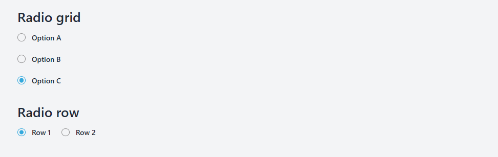

# Radio group Component



The **Radio** component in NT Stylesheet provides customizable radio buttons with support for grid (column) and row layouts. It uses pseudo-elements to create custom radio visuals without additional markup.

## Features

-   Custom styled radio buttons with animated selection indicator
-   Supports column grid layout (nt-radio-column) and row layout (nt-radio-row)
-   Uses pure CSS for custom radio dots with ::before and ::after
-   Easy to customize colors via CSS classes
-   Accessibility-friendly with hidden native radio inputs

## Installation

Import the stylesheet in your project:

```javascript
import '@nashtech/nt-stylesheet/dist/nt-stylesheet.css'
```

## Usage

Wrap your radio inputs inside `<label class="nt-radio">` to get the styled radio.

## Layouts

-   Use `.nt-radio-column` container for vertical stacked radios (grid column)
-   Use `.nt-radio-row` container for horizontal inline radios (row)

## Example Markup

```html
<main>
    <h2 class="text-3xl font-semibold mb-4">Radio grid</h2>
    <div class="nt-radio-column mb-10">
        <label class="nt-radio">
            <input type="radio" name="choice" value="1" />
            Option A
        </label>
        <label class="nt-radio">
            <input type="radio" name="choice" value="2" />
            Option B
        </label>
        <label class="nt-radio">
            <input type="radio" name="choice" value="3" />
            Option C
        </label>
    </div>
    <h2 class="text-3xl font-semibold mb-4">Radio row</h2>
    <div class="nt-radio-row">
        <label class="nt-radio">
            <input type="radio" name="layout" value="row1" />
            Row 1
        </label>
        <label class="nt-radio">
            <input type="radio" name="layout" value="row2" />
            Row 2
        </label>
    </div>
</main>
```

---

[Back to docs index](README.md)
