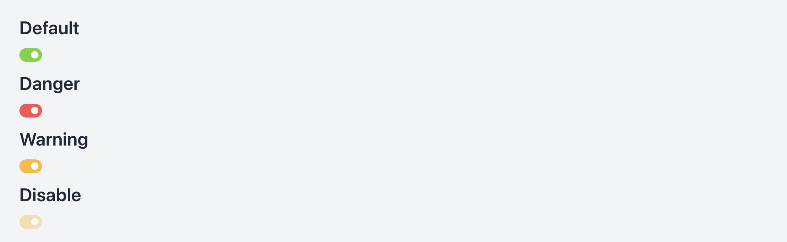

# Component



The Switch component in NT Stylesheet provides a flexible and accessible switch UI, supporting multiple color variants such as success, danger, and warning. It is built using native checkboxes and styled purely with CSS.

## Features

-   Custom switch built with pure CSS
-   Supports success (default), danger, and warning color variants
-   Smooth animated slider and circle knob
-   Fully accessible with hidden native checkbox input
-   Easy to extend with utility classes

## Installation

Import the stylesheet in your project:

```javascript
import '@nashtech/nt-stylesheet/dist/nt-stylesheet.css'
```

## Usage

Wrap a native checkbox input inside <label class="nt-switch"> to apply the base style. Add variant classes such as nt-switch, nt-switch-danger, or nt-switch-warning for different states.

## Variants

-   `.nt-switch` – Green background when checked
-   `.nt-switch-danger` – Red background when checked
-   `.nt-switch-warning` – Orange background when checked

## Example Markup

```html
<main>
    <h2 class="text-3xl font-semibold mb-4">Default</h2>
    <label class="nt-switch">
        <input type="checkbox" class="nt-switch-input" />
        <span class="nt-switch-slider"></span>
    </label>

    <h2 class="text-3xl font-semibold mt-10 mb-4">Color Variants</h2>

    <label class="nt-switch nt-switch-danger">
        <input type="checkbox" class="nt-switch-input" />
        <span class="nt-switch-slider"></span>
    </label>

    <label class="nt-switch nt-switch-warning">
        <input type="checkbox" class="nt-switch-input" />
        <span class="nt-switch-slider"></span>
    </label>

    <label class="nt-switch nt-switch-warning">
        <input
            type="checkbox"
            disabled
            checked
            class="nt-switch-input"
        />
        <span class="nt-switch-slider"></span>
    </label>
</main>
```

---

[Back to docs index](README.md)
