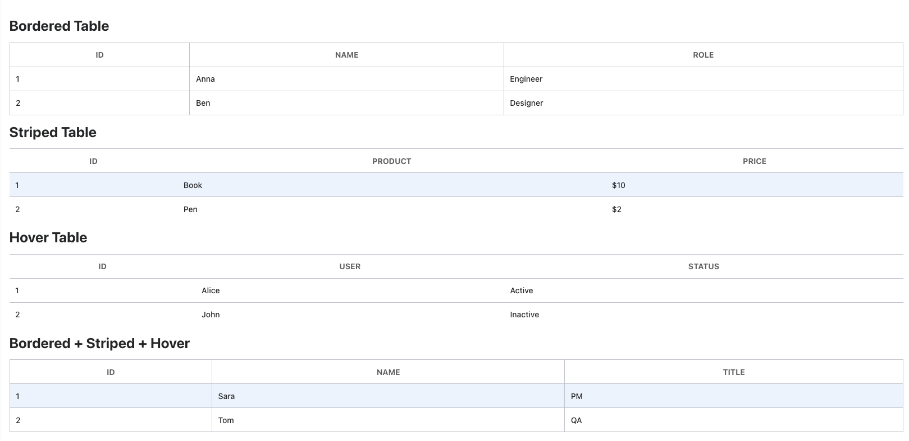

# Table Component



The Table component in NT Stylesheet provides a lightweight, responsive base for rendering tabular data. It supports styling variants for borders, row states, text alignment, and more — all through utility-based class names.

## Features

-   Customizable border styles
-   Support for striped and hoverable rows
-   Utility classes for text alignment (left, center, right)
-   Clean, semantic HTML
-   Easy integration with existing layouts

## Installation

Import the stylesheet into your project:

```js
import '@nashtech/nt-stylesheet/dist/nt-stylesheet.css'
```

## Usage

## Basic Table

Use the base nt-table class on your `<table>`element.

```html
<table class="nt-table">
    <thead>
        <tr>
            <th>#</th>
            <th>Item</th>
            <th>Qty</th>
        </tr>
    </thead>
    <tbody>
        <tr>
            <td>1</td>
            <td>Pen</td>
            <td>10</td>
        </tr>
        <tr>
            <td>2</td>
            <td>Notebook</td>
            <td>5</td>
        </tr>
    </tbody>
</table>
```

## Variants

### Bordered Table

Add `.nt-table-bordered` to show borders on the table and all cells.

```html
<table class="nt-table nt-table-bordered">
    ...
</table>
```

### No Border Table

Use `.nt-table-no-bordered` to remove all borders from the table and cells.

```html
<table class="nt-table nt-table-no-bordered"></table>
```

### Striped Rows

Apply `.nt-table-striped` to alternate row backgrounds for better readability.

```html
<table class="nt-table nt-table-striped">
    ...
</table>
```

### Hover Rows

Use `.nt-table-hover` to highlight a row on mouse hover.

```html
<table class="nt-table nt-table-hover"></table>
```

### Text Alignment

Align all cell content in a table using one of the following classes:

| Class              | Effect                |
| ------------------ | --------------------- |
| `.nt-table-left`   | Aligns text to left   |
| `.nt-table-center` | Aligns text to center |
| `.nt-table-right`  | Aligns text to right  |

## Summary of Class Modifiers

| Class                   | Description                                     |
| ----------------------- | ----------------------------------------------- |
| `.nt-table`             | Base table style                                |
| `.nt-table-bordered`    | Adds borders to the table and all cells         |
| `.nt-table-no-bordered` | Removes all table borders                       |
| `.nt-table-hover`       | Highlights row on hover                         |
| `.nt-table-striped`     | Alternates row background color (odd rows only) |
| `.nt-table-left`        | Aligns all text left                            |
| `.nt-table-center`      | Aligns all text center                          |
| `.nt-table-right`       | Aligns all text right                           |
