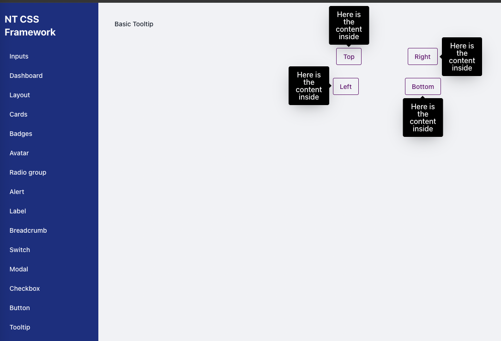

# Tooltip Component



The Tooltip component in NT Stylesheet provides contextual hints that appear when users hover over an element. It supports positioning (`top`, `right`, `bottom`, `left`), plain text or HTML content, and can be triggered entirely via data attributes.

## Features

-   Show tooltips on hover using data-nt-toggle="tooltip"
-   Supports text or rich HTML content
-   Positions: top, right, bottom, left
-   Automatically removes tooltip on mouse leave
-   Lightweight, zero dependency
-   Visual variants like success, warning, danger, info

## Installation

Import the stylesheet and script into your project:

```js
import '@nashtech/nt-stylesheet/dist/nt-stylesheet.css'
import '@nashtech/nt-stylesheet/dist/scripts/nt.js'
```

## Usage

### Basic Tooltip

Use the data-nt-toggle="tooltip" attribute on any element with a title to enable the tooltip.

```html
<button
    class="nt-button nt-button-primary"
    data-nt-toggle="tooltip"
    data-nt-placement="top"
    title="Tooltip on top"
>
    Tooltip on top
</button>
```

The tooltip will appear on hover and be automatically removed on mouse leave.

### Placements

Set the tooltip position using data-nt-placement:

-   top
-   right
-   bottom
-   left

```html
<div class="flex gap-2">
    <button
        data-nt-toggle="tooltip"
        data-nt-placement="top"
        title="Top"
    >
        Top
    </button>
    <button
        data-nt-toggle="tooltip"
        data-nt-placement="right"
        title="Right"
    >
        Right
    </button>
    <button
        data-nt-toggle="tooltip"
        data-nt-placement="bottom"
        title="Bottom"
    >
        Bottom
    </button>
    <button
        data-nt-toggle="tooltip"
        data-nt-placement="left"
        title="Left"
    >
        Left
    </button>
</div>
```

### HTML Tooltip

Use `data-nt-html="true"` to render HTML content from the title attribute.

### Tooltip Variants

Use the `data-nt-variant` attribute to apply different visual styles to the tooltip:

```html
<button
    class="nt-button nt-button-primary"
    data-nt-toggle="tooltip"
    data-nt-placement="top"
    title="Default tooltip"
>
    Default tooltip
</button>
```

Available variants:

-   success
-   warning
-   danger
-   info

-   The `variant` affects the background and text color of the tooltip to visually communicate the message type

### Advanced Options (via attributes)

| Attribute           | Type                                           | Default | Description                                           |
| ------------------- | ---------------------------------------------- | ------- | ----------------------------------------------------- |
| `data-nt-toggle`    | `"tooltip"`                                    | –       | Enables tooltip behavior on an element                |
| `title`             | `string` or `HTML`                             | –       | The tooltip content to display                        |
| `data-nt-html`      | `true` \| `false`                              | `false` | Allows HTML rendering in the tooltip content          |
| `data-nt-placement` | `'top'`, `'right'`, `'bottom'`, `'left'`       | `'top'` | Where to position the tooltip relative to the element |
| `data-nt-variant`   | `'success'`, `'warning'`, `'danger'`, `'info'` | –       | Changes tooltip color style                           |
